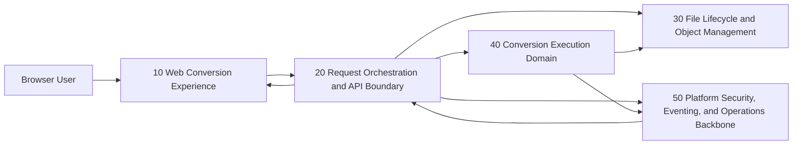

# ARCHITECTURE DESCRIPTION

## PROBLEM STATEMENT

### Objective

- System:
  - Cloud-native document-conversion application.
- Users / actors:
  - Browser-based users who upload files for conversion.
- Primary outcome:
  - Reliable conversion across common document and geospatial file formats with downloadable results.

### Scope boundaries

- In scope:
  - Text/document formats (for example: docx, markdown, rst, txt, pdf).
  - Geospatial formats (for example: gpx, kml, kmz, geojson).
  - Incremental MVP-friendly delivery.
- Out of scope:
  - Video, photo, audio, and other media conversion.

### Assumptions

- Application is hosted in cloud environments.
- Users interact through a browser UI.
- Inputs are uploaded files; outputs are downloadable converted files.
- Architecture follows a micro-service style.
- Delivery emphasizes MVP first, then expansion.

## Architectural components

### 10 — Web Conversion Experience

- Category:
  - client
- Purpose:
  - Provide the user-facing experience for file submission, conversion tracking, and result retrieval.
- Responsibilities:
  - Collect file and target format from user.
  - Initiate conversion requests.
  - Display conversion status, errors, and completion.
  - Trigger secure download when result is ready.
- Interfaces:
  - Incoming (one per flow)
    - Type: user actions
    - Short description: file selection, conversion request submission, status refresh, download action.
  - Outgoing:
    - Type: requests
    - Short description: sends conversion job requests and status queries to API-facing orchestration.

- Data / state:
  - Temporary UI state for selected file metadata, requested conversion options, and conversion progress indicators.
- Interactions:
  - User-facing:
    - Direct interaction with browser users.
  - Internal synchronous:
    - Calls API gateway/orchestration entrypoints for submit/status/download metadata.
  - Internal asynchronous:
    - Receives near-real-time status updates via polling or push notifications.
- Security / access considerations:
  - Enforces authenticated session where required.
  - Prevents client-side disclosure of internal identifiers or storage locations.
- Observability / operational considerations:
  - Captures client-visible failures and latency metrics for user flows.
- Dependencies:
  - 20
- Constraints / notes:
  - Must remain accessible and responsive for large-file upload workflows.

### 20 — Request Orchestration and API Boundary

- Category:
  - orchestration
- Purpose:
  - Serve as the controlled entry point for conversion lifecycle operations and route work to internal services.
- Responsibilities:
  - Validate conversion requests against supported format pairs.
  - Assign job identifiers and lifecycle state.
  - Coordinate file intake, conversion execution, and result publication.
  - Provide status/read APIs to clients.
- Interfaces:
  - Incoming (one per flow)
    - Type: requests
    - Short description: receives submit/status/download-readiness requests from the web experience.
  - Outgoing:
    - Type: commands/events/responses
    - Short description: emits job commands to conversion domain services, returns status and result metadata to clients.

- Data / state:
  - Job lifecycle metadata (queued, running, succeeded, failed, expired), validation outcomes, and result references.
- Interactions:
  - User-facing:
    - Exposes externally consumable API contract through controlled boundary.
  - Internal synchronous:
    - Coordinates with file lifecycle service for upload/download token handling.
  - Internal asynchronous:
    - Publishes job execution requests and consumes completion/failure events.
- Security / access considerations:
  - Enforces request authorization, payload checks, and rate controls.
- Observability / operational considerations:
  - Central tracing anchor for end-to-end conversion flows.
  - Tracks conversion success/failure rates by format pair.
- Dependencies:
  - 30, 40, 50
- Constraints / notes:
  - Must support incremental onboarding of new conversion capabilities with minimal external API churn.

### 30 — File Lifecycle and Object Management

- Category:
  - data persistence
- Purpose:
  - Manage durable storage, retention, and controlled access to uploaded source files and converted outputs.
- Responsibilities:
  - Store uploaded source files and produced output files.
  - Generate short-lived access handles for upload/download paths.
  - Enforce retention/expiry policies for temporary conversion artifacts.
- Interfaces:
  - Incoming (one per flow)
    - Type: commands/requests
    - Short description: receives store/retrieve/delete and access-handle requests from orchestration.
  - Outgoing:
    - Type: responses/events
    - Short description: returns storage references, transfer authorization material, and artifact lifecycle events.

- Data / state:
  - Raw file objects, converted objects, metadata (size, type, retention timestamp), and access-control bindings.
- Interactions:
  - User-facing:
    - Indirect via secure upload/download paths.
  - Internal synchronous:
    - Serves metadata and object access to orchestration and conversion workers.
  - Internal asynchronous:
    - Emits artifact expiry and cleanup events.
- Security / access considerations:
  - Trust boundary for user-provided files and generated artifacts.
  - Requires strict access scoping and data-at-rest protections.
- Observability / operational considerations:
  - Monitors storage growth, object lifecycle policy effectiveness, and transfer errors.
- Dependencies:
  - 50
- Constraints / notes:
  - Must support large object handling and resumable transfer semantics.

### 40 — Conversion Execution Domain

- Category:
  - domain service
- Purpose:
  - Execute format-specific conversion jobs reliably and report deterministic outcomes.
- Responsibilities:
  - Consume conversion job commands.
  - Apply format adapters/handlers to transform input to requested output.
  - Report success, partial capability mismatches, or structured failure reasons.
- Interfaces:
  - Incoming (one per flow)
    - Type: commands
    - Short description: receives conversion tasks with input/output references and processing directives.
  - Outgoing:
    - Type: events
    - Short description: emits started/progress/completed/failed job events with output references.

- Data / state:
  - Execution context, transient processing artifacts, conversion capability catalog by format pair.
- Interactions:
  - User-facing:
    - None directly.
  - Internal synchronous:
    - Fetches input objects and stores output artifacts through file lifecycle service.
  - Internal asynchronous:
    - Processes queued work and publishes lifecycle events to orchestration.
- Security / access considerations:
  - Treats uploaded files as untrusted inputs.
  - Enforces execution isolation between jobs.
- Observability / operational considerations:
  - Tracks throughput, queue latency, per-format failure patterns, and retry behavior.
- Dependencies:
  - 30, 50
- Constraints / notes:
  - Must allow adding new format handlers without redesigning orchestration contracts.
- Principal alternative (optional)
  - A unified monolithic converter could simplify early MVP delivery, but reduces isolation and independent scaling for workload-heavy format groups.

### 50 — Platform Security, Eventing, and Operations Backbone

- Category:
  - observability
- Purpose:
  - Provide shared cross-cutting capabilities for identity, policy enforcement, asynchronous messaging, and operational visibility.
- Responsibilities:
  - Maintain authentication and authorization context propagation.
  - Provide reliable asynchronous transport for job/event flow.
  - Aggregate logs, metrics, traces, and audit records.
  - Support operational controls (alerts, policy checks, incident diagnostics).
- Interfaces:
  - Incoming (one per flow)
    - Type: upstream inputs/events
    - Short description: receives telemetry streams, policy evaluation requests, and domain events.
  - Outgoing:
    - Type: downstream outputs/events/responses
    - Short description: distributes events, emits alerts, and provides observability datasets to operators.

- Data / state:
  - Identity claims, policy decisions, event delivery state, telemetry and audit history.
- Interactions:
  - User-facing:
    - Indirect (administrative/operational access).
  - Internal synchronous:
    - Policy decisions and access checks for service-to-service requests.
  - Internal asynchronous:
    - Event fanout, retries, dead-letter handling, and alert emission.
- Security / access considerations:
  - Central authority for access policy consistency and auditability.
- Observability / operational considerations:
  - Defines SLO/SLA visibility and incident response signals across all components.
- Dependencies:
  - None
- Constraints / notes:
  - Must be designed as reusable shared capability across MVP and future extensions.

## System interaction summary

- Primary request / control paths:
  - User submits conversion in component 10.
  - Component 20 validates and creates a job record, requests file intake via 30, and issues execution commands toward 40.
  - Completion events flow back through 50 to 20, then surfaced to 10 for user download action.
- Primary data flows:
  - Input artifact flows from user through 10 to 30.
  - 40 reads input from 30 and writes converted output back to 30.
  - 20 exposes result availability and retrieval metadata to 10.
- Primary event flows:
  - 20 emits conversion command events.
  - 40 emits progress/completion/failure events.
  - 50 provides durable delivery, retry, and operational alerting around these flows.

## System-wide concerns

- Security and access control:
  - Validate file type and request authorization at entry.
  - Isolate conversion execution for untrusted content.
  - Restrict artifact access with scoped, time-bound access handles.
- Reliability and recovery:
  - Idempotent job submission and event handling.
  - Retry with bounded backoff for transient conversion failures.
  - Recovery paths for orphaned jobs and expired artifacts.
- Observability and operations:
  - End-to-end tracing across submit-to-download lifecycle.
  - Per-format and per-component health/error dashboards.
  - Audit trail for user actions and job outcomes.
- Performance and scalability:
  - Horizontal scaling of conversion workers by workload profile.
  - Backpressure/queue controls for burst uploads.
  - Size-aware handling for large input/output artifacts.
- Compliance / audit / governance:
  - Data retention windows for uploaded and converted artifacts.
  - Auditability for conversion activity and administrative interventions.

## Open questions

- What maximum file sizes and per-user throughput should the MVP support?
- Should anonymous conversion be allowed, or must all usage be authenticated from day one?
- What retention period should apply to converted artifacts before automatic deletion?
- Which format-pair conversions are MVP-critical versus phase-two capabilities?

## Graph representation

