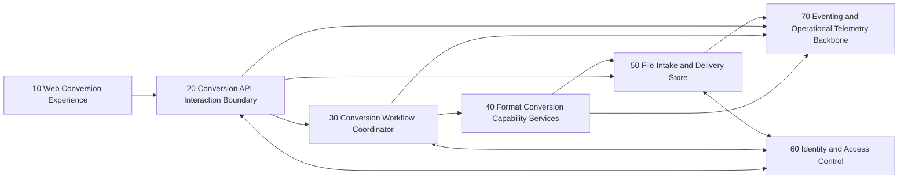

# ARCHITECTURE DESCRIPTION

The response must provide one or more architectural component, adhering to this format and describes the solution.

# PROBLEM STATEMENT

## Objective

- System:
  - We want to design a cloud-native, document-conversion application.
- Users / actors:
  - Browser-based users on the web accessing a website to convert files to different formats
- Primary outcome:
  - Allows a host of conversion for different common filestypes

## Scope boundaries

- In scope:
  - Common text files formats such as docx, docs, markdown, raw text, PDF, rst...
  - Common geo files such as gpx, kml, kmz, geojson
- Out of scope:
  - Videos, photos, audio and media files

## Assumptions

- The application will live in the cloud
- users with upload their files via a web browser
- they will get their files back via file download after the conversion is finished
- The application will be based on a micro-service architecture
- The application will be developped incrementally. The development should emphasis a MVP approach

## Architectural components

### 10 — Web Conversion Experience

- Category:
  - client
- Purpose:
  - Provide a browser-based user experience to submit files, select output formats, track conversion progress, and download converted outputs.
- Responsibilities:
  - Collect conversion input and user choices.
  - Validate basic user inputs before submission.
  - Display job lifecycle states (accepted, processing, completed, failed).
  - Provide download action for completed outputs.
- Interfaces:
  - Incoming (one per flow)
    - Type: user actions
    - Short description: Upload file, choose source/target format, submit conversion request, poll or refresh job status, download output.
  - Outgoing:
    - Type: requests
    - Short description: Sends conversion requests and job status queries to the API interaction boundary.

- Data / state:
  - Temporary in-session UI state for selected file metadata and job status snapshots.
- Interactions:
  - User-facing:
    - Direct browser interactions for upload, status visibility, and retrieval.
  - Internal synchronous:
    - Calls component 20 for request submission and status lookup.
  - Internal asynchronous:
    - None required for MVP; periodic status polling is sufficient.
- Security / access considerations:
  - Must not expose sensitive file contents in logs or browser storage.
  - Requires secure transport and upload size/type validation feedback.
- Observability / operational considerations:
  - Capture user-visible errors with correlation to backend job identifiers.
- Dependencies:
  - 20
- Constraints / notes:
  - Must remain simple for MVP and support progressive UX enhancement later.

### 20 — Conversion API Interaction Boundary

- Category:
  - orchestration
- Purpose:
  - Serve as the system entry point that accepts conversion requests, enforces request policy, and returns consistent status/output references.
- Responsibilities:
  - Validate request envelope and supported conversion intent.
  - Create and track conversion jobs.
  - Expose job status and output retrieval metadata.
  - Coordinate work dispatch to orchestration and conversion components.
- Interfaces:
  - Incoming (one per flow)
    - Type: requests
    - Short description: Receives upload metadata, conversion intent, job status queries, and output fetch requests.
  - Outgoing:
    - Type: commands / responses
    - Short description: Sends workflow commands to component 30 and returns normalized responses to component 10.

- Data / state:
  - Job records, request metadata, lifecycle timestamps, and output reference pointers.
- Interactions:
  - User-facing:
    - Indirect via client responses consumed by component 10.
  - Internal synchronous:
    - Calls component 40 for capability checks and conversion initiation.
  - Internal asynchronous:
    - Emits job lifecycle events to component 70.
- Security / access considerations:
  - Enforces request-level access policy and payload limits.
  - Performs trust-boundary checks for upload and download tokens.
- Observability / operational considerations:
  - Generates correlation identifiers and structured audit events for each job transition.
- Dependencies:
  - 30, 40, 50, 70
- Constraints / notes:
  - Must support idempotent submission and resilient status retrieval.

### 30 — Conversion Workflow Coordinator

- Category:
  - orchestration
- Purpose:
  - Manage the conversion lifecycle from intake through completion/failure with explicit state transitions.
- Responsibilities:
  - Drive workflow states and retry policy.
  - Decide routing to appropriate conversion capability family.
  - Handle timeout, failure, and compensation pathways.
  - Publish final outcome state back to API/job store.
- Interfaces:
  - Incoming (one per flow)
    - Type: commands / events
    - Short description: Receives create-job commands and conversion processing outcomes.
  - Outgoing:
    - Type: commands / events
    - Short description: Dispatches conversion tasks to component 40 and emits state changes to component 70.

- Data / state:
  - Workflow state machine data for each conversion job.
- Interactions:
  - User-facing:
    - None direct.
  - Internal synchronous:
    - Updates component 20 job state and calls component 50 for file location handoffs.
  - Internal asynchronous:
    - Consumes and emits lifecycle events with component 70.
- Security / access considerations:
  - Propagates least-privilege access context to downstream processing.
- Observability / operational considerations:
  - Maintains traceable state transitions and retry/failure reason codes.
- Dependencies:
  - 20, 40, 50, 70
- Constraints / notes:
  - Workflow definitions should stay format-agnostic to enable incremental capabilities.

### 40 — Format Conversion Capability Services

- Category:
  - domain service
- Purpose:
  - Execute document and geo-file transformations according to declared source and target formats.
- Responsibilities:
  - Validate format compatibility and conversion constraints.
  - Perform actual content transformation.
  - Return output artifacts and conversion diagnostics.
- Interfaces:
  - Incoming (one per flow)
    - Type: commands
    - Short description: Receives conversion task with source reference and target format.
  - Outgoing:
    - Type: events / downstream outputs
    - Short description: Publishes success/failure outcomes and output references.

- Data / state:
  - Stateless processing context plus ephemeral working files during execution.
- Interactions:
  - User-facing:
    - None.
  - Internal synchronous:
    - Reads source files and writes outputs through component 50.
  - Internal asynchronous:
    - Returns completion/failure events to component 30 via component 70.
- Security / access considerations:
  - Must isolate untrusted user files during processing.
  - Enforces strict content-type and size guardrails before conversion.
- Observability / operational considerations:
  - Emits per-task performance and failure metrics by format pair.
- Dependencies:
  - 50, 70
- Constraints / notes:
  - Capability expansion should be modular to support incremental format onboarding.
- Principal alternative (optional)
  - A single generalized conversion engine could simplify operations early, but distinct capability services provide clearer isolation and scaling boundaries as supported format families grow.

### 50 — File Intake and Delivery Store

- Category:
  - data persistence
- Purpose:
  - Persist uploaded input files and generated outputs with controlled lifecycle and secure retrieval.
- Responsibilities:
  - Store source and converted artifacts.
  - Provide file references for processing and download.
  - Enforce retention windows and cleanup policies.
- Interfaces:
  - Incoming (one per flow)
    - Type: upstream inputs / commands
    - Short description: Accepts file writes from intake and conversion components.
  - Outgoing:
    - Type: downstream outputs
    - Short description: Serves file reads to conversion services and download responses.

- Data / state:
  - Binary artifacts, integrity metadata, retention timestamps, and ownership linkage to job records.
- Interactions:
  - User-facing:
    - Indirect through API-generated download links.
  - Internal synchronous:
    - Serves reads/writes for components 20, 30, and 40.
  - Internal asynchronous:
    - Emits retention-expiry notifications to component 70.
- Security / access considerations:
  - Encrypted-at-rest behavior and controlled signed access for retrieval.
- Observability / operational considerations:
  - Tracks artifact access, storage growth, and cleanup outcomes.
- Dependencies:
  - 70
- Constraints / notes:
  - Must support temporary storage model suitable for MVP and compliance evolution.

### 60 — Identity and Access Control

- Category:
  - identity and access
- Purpose:
  - Provide authentication context and authorization decisions for user and service interactions.
- Responsibilities:
  - Verify user/session identity where required.
  - Apply authorization policies for conversion request and output retrieval actions.
  - Issue and validate short-lived access context for service-to-service operations.
- Interfaces:
  - Incoming (one per flow)
    - Type: requests
    - Short description: Receives identity validation and permission check requests.
  - Outgoing:
    - Type: responses
    - Short description: Returns allow/deny decisions with identity claims.

- Data / state:
  - Identity claims, policy definitions, and access decision logs.
- Interactions:
  - User-facing:
    - Optional session establishment and account association.
  - Internal synchronous:
    - Provides policy decisions to component 20 and token/context checks to components 30 and 50.
  - Internal asynchronous:
    - None required for MVP.
- Security / access considerations:
  - Defines trust boundaries and ensures least-privilege enforcement.
- Observability / operational considerations:
  - Captures auditable access decision trails.
- Dependencies:
  - 20, 30, 50
- Constraints / notes:
  - For MVP, can start with lightweight access patterns while preserving evolution path to stronger identity requirements.

### 70 — Eventing and Operational Telemetry Backbone

- Category:
  - messaging
- Purpose:
  - Provide asynchronous event transport for job lifecycle communication and centralized operational telemetry collection.
- Responsibilities:
  - Carry domain events between API, workflow, conversion, and storage components.
  - Feed monitoring, alerting, and audit pipelines.
  - Support decoupled retry and backpressure handling.
- Interfaces:
  - Incoming (one per flow)
    - Type: events
    - Short description: Receives lifecycle, access, and storage events from core components.
  - Outgoing:
    - Type: events / downstream outputs
    - Short description: Delivers events to interested internal consumers and operational sinks.

- Data / state:
  - Event streams, delivery state, and telemetry aggregation snapshots.
- Interactions:
  - User-facing:
    - None.
  - Internal synchronous:
    - None.
  - Internal asynchronous:
    - Core event exchange among components 20, 30, 40, and 50.
- Security / access considerations:
  - Applies producer/consumer authorization and tamper-evident event handling.
- Observability / operational considerations:
  - Enables end-to-end tracing, alerting, and historical analysis.
- Dependencies:
  - 20, 30, 40, 50
- Constraints / notes:
  - Event schema governance is required to avoid coupling drift.

### System interaction summary

- Primary request / control paths:
  - User submits conversion through component 10 to component 20, which registers a job and invokes component 30.
  - Component 30 dispatches conversion work to component 40 and updates job lifecycle in component 20.
  - User checks status and downloads output through component 10 via component 20.
- Primary data flows:
  - Source files move from component 10 through component 20 into component 50.
  - Component 40 reads source artifacts from component 50 and writes converted outputs back to component 50.
  - Component 20 returns retrievable output references to component 10.
- Primary event flows:
  - Components 20/30/40/50 publish lifecycle and operational events to component 70.
  - Component 70 distributes events for workflow continuation, monitoring, and auditing.

### System-wide concerns

- Security and access control:
  - Enforce trust boundaries at intake, processing, and retrieval stages.
  - Ensure least-privilege access between services and controlled user download permissions.
  - Protect sensitive content in transit, at rest, and in logs.
- Reliability and recovery:
  - Idempotent job creation and resilient retries for transient conversion failures.
  - Explicit job state transitions with observable failure reasons.
  - Artifact lifecycle cleanup to prevent stale state accumulation.
- Observability and operations:
  - Correlated tracing across request, workflow, conversion, and storage boundaries.
  - Metrics for queue depth, conversion duration, failure rates, and storage growth.
  - Audit records for access decisions and file retrieval actions.
- Performance and scalability:
  - Horizontal scaling of conversion capabilities by workload type.
  - Decouple request handling from heavy processing through asynchronous workflow.
  - Optimize file movement and avoid unnecessary data duplication.
- Compliance / audit / governance:
  - Retention and deletion controls for uploaded and converted artifacts.
  - Traceability for user actions and conversion outcomes.
  - Governance for supported format catalog and conversion policy changes.

### Open questions
- Should anonymous usage be supported for MVP, or should all conversions require authenticated identity context?
- What are the retention and deletion policy requirements for input/output artifacts by default?
- Which conversion outcomes should be exposed directly to users versus only in operator telemetry?

### Graph representation

