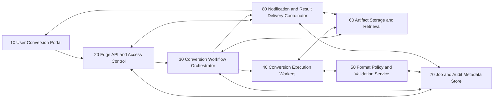

# ARCHITECTURE DESCRIPTION

The response must provide one or more architectural component, adhering to this format and describes the solution.

# PROBLEM STATEMENT

## Objective

- System:
  - We want to design a cloud-native, document-conversion application.
- Users / actors:
  - Browser-based users on the web accessing a website to convert files to different formats
- Primary outcome:
  - Allows a host of conversion for different common filestypes

## Scope boundaries

- In scope:
  - Common text files formats such as docx, docs, markdown, raw text, PDF, rst...
  - Common geo files such as gpx, kml, kmz, geojson
- Out of scope:
  - Videos, photos, audio and media files

## Assumptions

- The application will live in the cloud
- users with upload their files via a web browser
- they will get their files back via file download after the conversion is finished
- The application will be based on a micro-service architecture
- The application will be developped incrementally. The development should emphasis a MVP approach

## Architectural components

### 10 — User Conversion Portal

- Category:
  - client
- Purpose:
  - Provide a browser-based experience where users submit files, pick output formats, and retrieve results.
- Responsibilities:
  - Collect user input and conversion preferences.
  - Upload source files through controlled flows.
  - Display conversion progress and outcomes.
  - Trigger download once conversion artifacts are available.
- Interfaces:
  - Incoming (one per flow)
    - Type: user actions
    - Short description: upload file, select target format, submit conversion, check status, download output.
  - Outgoing:
    - Type: requests
    - Short description: sends conversion requests and status polling/subscription requests to the edge/API layer.

- Data / state:
  - Local UI state (selected files, requested target format, job status view).
  - Temporary upload context and download links/tokens.
- Interactions:
  - User-facing:
    - End users perform conversion actions through forms and status views.
  - Internal synchronous:
    - Communicates request/response with component 20.
  - Internal asynchronous:
    - Receives async status updates or completion notifications initiated by components 20 and 80.
- Security / access considerations:
  - Must enforce authenticated session handling when accounts are enabled.
  - Should avoid exposing raw storage locations and internal identifiers.
- Observability / operational considerations:
  - Client-side telemetry for failed uploads, timeout behavior, and conversion completion rates.
- Dependencies:
  - 20, 80
- Constraints / notes:
  - Should support incremental MVP rollout with a minimal UX first.

### 20 — Edge API and Access Control

- Category:
  - orchestration
- Purpose:
  - Act as the trust boundary for all client traffic and coordinate authenticated, validated access to conversion capabilities.
- Responsibilities:
  - Receive and validate incoming conversion requests.
  - Apply authentication, authorization, and input policy checks.
  - Route accepted requests to orchestration workflows.
  - Serve job-status and result-access requests back to clients.
- Interfaces:
  - Incoming (one per flow)
    - Type: requests
    - Short description: API calls from component 10 for upload/session initiation, conversion request submission, and status retrieval.
  - Outgoing:
    - Type: commands
    - Short description: dispatches commands to component 30 to create and manage conversion jobs.

- Data / state:
  - Request metadata, access context, and short-lived session tokens.
  - No long-lived conversion artifacts; references only.
- Interactions:
  - User-facing:
    - Returns accepted/rejected outcomes and status snapshots to users.
  - Internal synchronous:
    - Calls component 70 for metadata lookups and policy checks.
  - Internal asynchronous:
    - Publishes conversion start commands to component 30 and receives status updates through component 80.
- Security / access considerations:
  - Primary inbound trust boundary.
  - Enforces payload limits, file-type allow lists, and abuse controls.
- Observability / operational considerations:
  - Tracks request latency, rejection reasons, and error rates by endpoint.
- Dependencies:
  - 30, 70, 80
- Constraints / notes:
  - Must remain stateless enough to scale independently of job execution volume.

### 30 — Conversion Workflow Orchestrator

- Category:
  - orchestration
- Purpose:
  - Manage conversion job lifecycles from intake through completion/failure using durable workflow state.
- Responsibilities:
  - Create conversion jobs and transition lifecycle states.
  - Split work into executable tasks and dispatch to worker capabilities.
  - Handle retries, timeout logic, and failure routing.
  - Aggregate results and mark jobs complete.
- Interfaces:
  - Incoming (one per flow)
    - Type: commands
    - Short description: receives conversion start commands and cancellation requests.
  - Outgoing:
    - Type: commands/events
    - Short description: sends executable conversion tasks to component 40 and emits lifecycle events to component 80.

- Data / state:
  - Durable job state machine, retry counters, conversion stage timestamps, and error classifications.
- Interactions:
  - User-facing:
    - None directly.
  - Internal synchronous:
    - Reads/writes job metadata in component 70.
    - Reads artifact references from component 60.
  - Internal asynchronous:
    - Queues work to component 40 and emits completion/failure events to component 80.
- Security / access considerations:
  - Operates on validated requests only, never direct browser input.
  - Uses least-privilege access to artifact and metadata systems.
- Observability / operational considerations:
  - Must expose queue depth, retry trends, stage durations, and failure patterns.
- Dependencies:
  - 40, 60, 70, 80
- Constraints / notes:
  - Needs predictable idempotency behavior for duplicate submissions or retry scenarios.

### 40 — Conversion Execution Workers

- Category:
  - domain service
- Purpose:
  - Execute actual file-format transformation tasks for text and geospatial document classes.
- Responsibilities:
  - Fetch source artifacts, perform format conversion, and validate output integrity.
  - Report task outcomes and error diagnostics.
  - Support pluggable conversion handlers by document family.
- Interfaces:
  - Incoming (one per flow)
    - Type: commands
    - Short description: receives conversion task instructions including source format, target format, and artifact references.
  - Outgoing:
    - Type: events/downstream outputs
    - Short description: writes converted artifacts and emits task success/failure details.

- Data / state:
  - Ephemeral execution state, temporary processing buffers, and conversion logs.
- Interactions:
  - User-facing:
    - None.
  - Internal synchronous:
    - Reads/writes file artifacts in component 60.
    - Uses conversion policy metadata in component 50.
  - Internal asynchronous:
    - Sends task-completion events to component 30.
- Security / access considerations:
  - Must execute untrusted file content in isolated runtime boundaries.
  - Restricts egress and lateral access during conversion runs.
- Observability / operational considerations:
  - Capture per-format success rates, execution time, and resource usage.
- Dependencies:
  - 50, 60
- Constraints / notes:
  - MVP can prioritize a small set of formats while preserving extension points for additional handlers.

### 50 — Format Policy and Validation Service

- Category:
  - domain service
- Purpose:
  - Centralize conversion capability definitions and validation rules for supported source/target pairs.
- Responsibilities:
  - Maintain supported format matrix.
  - Validate requests against allowed conversions and business constraints.
  - Provide normalization and pre-check rules to orchestration and workers.
- Interfaces:
  - Incoming (one per flow)
    - Type: requests
    - Short description: receives format compatibility checks and policy lookups.
  - Outgoing:
    - Type: responses
    - Short description: returns allow/deny decisions, normalized format descriptors, and rule metadata.

- Data / state:
  - Conversion capability matrix and policy constraints.
- Interactions:
  - User-facing:
    - None.
  - Internal synchronous:
    - Called by components 20, 30, and 40 for request validation and execution-time checks.
  - Internal asynchronous:
    - None.
- Security / access considerations:
  - Acts as policy authority; updates should be controlled and auditable.
- Observability / operational considerations:
  - Track rejected conversion pairs and policy-hit distribution.
- Dependencies:
  - 70
- Constraints / notes:
  - Policy updates should not require redeploying the full workflow.

### 60 — Artifact Storage and Retrieval

- Category:
  - data persistence
- Purpose:
  - Store uploaded source files and produced conversion outputs with controlled lifecycle and retrieval access.
- Responsibilities:
  - Persist binary artifacts for input and output documents.
  - Provide secure read/write access patterns for internal services.
  - Manage retention and cleanup windows.
- Interfaces:
  - Incoming (one per flow)
    - Type: downstream inputs
    - Short description: receives artifact upload/write requests and retrieval requests from trusted components.
  - Outgoing:
    - Type: downstream outputs
    - Short description: returns artifact streams and immutable references.

- Data / state:
  - Source and converted file binaries.
  - Retention metadata and access references.
- Interactions:
  - User-facing:
    - Indirectly accessed through generated download flows via components 20 and 80.
  - Internal synchronous:
    - Accessed by components 30 and 40 for orchestration and processing.
  - Internal asynchronous:
    - Optional event emission on artifact lifecycle milestones.
- Security / access considerations:
  - Encrypt artifacts at rest and enforce strict access delegation.
  - Prevent direct public exposure of storage namespaces.
- Observability / operational considerations:
  - Monitor storage growth, retrieval failures, and artifact expiration behavior.
- Dependencies:
  - none
- Constraints / notes:
  - Retention policy should align with privacy expectations and operational cost boundaries.

### 70 — Job and Audit Metadata Store

- Category:
  - data persistence
- Purpose:
  - Persist non-binary system records required for workflow continuity, user-facing status, and operational auditability.
- Responsibilities:
  - Store job metadata and lifecycle history.
  - Store request context, policy decisions, and failure reasons.
  - Support status query workloads.
- Interfaces:
  - Incoming (one per flow)
    - Type: downstream inputs
    - Short description: receives metadata write/read requests from orchestration and API components.
  - Outgoing:
    - Type: downstream outputs
    - Short description: returns durable metadata records for status and governance views.

- Data / state:
  - Job states, timestamps, actor identity references, policy evaluation outcomes, and audit records.
- Interactions:
  - User-facing:
    - Indirect, via status responses assembled by component 20.
  - Internal synchronous:
    - Accessed by components 20, 30, and 50.
  - Internal asynchronous:
    - Receives eventual consistency updates from component 80 if needed.
- Security / access considerations:
  - Audit trail must be tamper-evident and access-controlled.
- Observability / operational considerations:
  - Track consistency lag, query latency, and audit completeness.
- Dependencies:
  - none
- Constraints / notes:
  - Schema must support incremental rollout of new conversion types without disruptive migrations.

### 80 — Notification and Result Delivery Coordinator

- Category:
  - messaging
- Purpose:
  - Propagate conversion lifecycle events and coordinate user-facing completion signaling and result access readiness.
- Responsibilities:
  - Consume workflow events and translate them into client-visible status signals.
  - Coordinate generation of time-bound result retrieval references.
  - Decouple orchestration internals from user notification behavior.
- Interfaces:
  - Incoming (one per flow)
    - Type: events
    - Short description: receives job state events from component 30.
  - Outgoing:
    - Type: events/responses
    - Short description: emits status updates for component 20/10 and delivery readiness events.

- Data / state:
  - Notification state, delivery attempts, and transient result-access coordination data.
- Interactions:
  - User-facing:
    - Drives status change visibility and completion notifications in component 10.
  - Internal synchronous:
    - Reads job context from component 70 and artifact references from component 60.
  - Internal asynchronous:
    - Subscribes to component 30 events and publishes update events to component 20.
- Security / access considerations:
  - Ensures delivery metadata does not expose sensitive document details.
- Observability / operational considerations:
  - Track notification lag, undelivered events, and duplicate-signal suppression.
- Dependencies:
  - 20, 30, 60, 70
- Constraints / notes:
  - Should tolerate temporary downstream unavailability without losing completion signals.

### System interaction summary

- Primary request / control paths:
  - Users submit conversion requests in component 10, routed through component 20, then orchestrated by component 30 into executable worker tasks in component 40.
- Primary data flows:
  - Source and output files flow through component 60, while lifecycle and audit metadata flows through component 70.
- Primary event flows:
  - Component 30 emits lifecycle events consumed by component 80, which propagates client-facing status updates back through component 20 to component 10.

### System-wide concerns

- Security and access control:
  - Strict trust boundary at component 20.
  - Isolation of untrusted file execution in component 40.
  - Least-privilege service-to-service access for components 30/40/80 to components 60 and 70.
- Reliability and recovery:
  - Durable job state machine in component 30 with retry semantics.
  - Artifact and metadata separation to simplify partial recovery.
  - Event-driven completion signals with replay-tolerant consumers.
- Observability and operations:
  - End-to-end correlation IDs across components 20–80.
  - Operational dashboards for queue depth, conversion latency, and failure taxonomy.
  - Audit record integrity for policy decisions and conversion outcomes.
- Performance and scalability:
  - Independent horizontal scaling for edge/API, orchestration, and worker components.
  - Async workflows prevent long-running conversion tasks from blocking user interactions.
  - Format-policy lookups centralized for consistent admission control.
- Compliance / audit / governance:
  - Retention windows for file artifacts.
  - Durable metadata for request traceability and decision audit.
  - Explicit format policy governance via component 50.

### Open questions
- Should the MVP require authenticated user accounts, or allow anonymous conversions with temporary access tokens?
- What maximum file size and execution time limits should define admission and timeout behavior?
- Should completed result notifications be polling-only in MVP or include push-based signaling from day one?

### Graph representation

