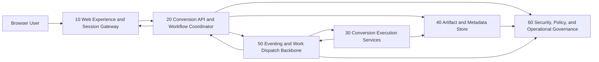

# ARCHITECTURE DESCRIPTION

## PROBLEM STATEMENT

### Objective

- System:
  - Cloud-native document-conversion application.
- Users / actors:
  - Browser-based users uploading and downloading files through a web experience.
- Primary outcome:
  - Convert common document and geospatial file types between supported formats.

### Scope boundaries

- In scope:
  - Textual/document formats (for example: docx, docs, markdown, raw text, PDF, rst).
  - Geospatial formats (for example: gpx, kml, kmz, geojson).
- Out of scope:
  - Video, photo, audio, and media conversion.

### Assumptions

- The application runs in a cloud environment.
- Users upload files from a browser and retrieve converted outputs by download.
- Architecture follows a microservice style.
- Delivery is incremental with an MVP-first approach.

## Architectural components

### 10 — Web Experience and Session Gateway

- Category:
  - client
- Purpose:
  - Provide user-facing flows for file submission, conversion tracking, and result retrieval.
- Responsibilities:
  - Accept user file selection and conversion parameters.
  - Validate basic client-side constraints before submission.
  - Display conversion status and offer result download links.
  - Manage user session context for request correlation.
- Interfaces:
  - Incoming (one per flow)
    - Type: user actions
    - Short description: User uploads source file, selects target format, and initiates conversion.
  - Outgoing:
    - Type: requests
    - Short description: Sends conversion requests and polling/notification subscriptions to backend API surface.

- Data / state:
  - Temporary session state (job references, selected formats, UI status).
- Interactions:
  - User-facing:
    - Upload form, conversion options, progress feedback, and download action.
  - Internal synchronous:
    - Calls Component 20 for job creation and status retrieval.
  - Internal asynchronous:
    - Receives completion notifications originating from Component 20/30.
- Security / access considerations:
  - Session authentication context, anti-abuse controls on upload attempts, and safe handling of transient file metadata.
- Observability / operational considerations:
  - Client journey telemetry for drop-off points and conversion failure visibility.
- Dependencies:
  - 20
- Constraints / notes:
  - Must remain responsive for potentially long-running conversions.

### 20 — Conversion API and Workflow Coordinator

- Category:
  - orchestration
- Purpose:
  - Serve as entry point for conversion requests and coordinate the conversion lifecycle.
- Responsibilities:
  - Receive and validate conversion requests.
  - Persist job metadata and lifecycle state transitions.
  - Route jobs to appropriate conversion capability based on format pair.
  - Publish job events and expose status/read models for clients.
- Interfaces:
  - Incoming (one per flow)
    - Type: requests
    - Short description: Receives job creation and status requests from Component 10.
  - Outgoing:
    - Type: commands/events/responses
    - Short description: Issues conversion commands to Component 30, stores artifacts in Component 40, emits lifecycle events to Component 50, and returns status/results to Component 10.

- Data / state:
  - Conversion job records, state machine transitions, supported format catalog snapshot.
- Interactions:
  - User-facing:
    - Indirectly supports user status and completion from API responses.
  - Internal synchronous:
    - Reads/writes job metadata through Component 40.
  - Internal asynchronous:
    - Emits and consumes job lifecycle events via Component 50.
- Security / access considerations:
  - Enforces authorization checks for job visibility and artifact retrieval scope.
- Observability / operational considerations:
  - End-to-end tracing across request-to-conversion lifecycle and SLA metrics by conversion pair.
- Dependencies:
  - 30, 40, 50, 60
- Constraints / notes:
  - Must remain stateless at runtime except for externally persisted workflow state.

### 30 — Conversion Execution Services

- Category:
  - domain service
- Purpose:
  - Perform actual file format transformation within isolated execution units.
- Responsibilities:
  - Execute conversion logic per supported format pair.
  - Validate source/target compatibility and report deterministic errors.
  - Stream or stage produced outputs for durable storage.
- Interfaces:
  - Incoming (one per flow)
    - Type: commands
    - Short description: Receives conversion execution commands with source artifact references.
  - Outgoing:
    - Type: events/downstream outputs
    - Short description: Returns conversion outcomes, error signals, and output artifact references.

- Data / state:
  - Ephemeral execution state, temporary working files, conversion capability registry.
- Interactions:
  - User-facing:
    - None directly.
  - Internal synchronous:
    - Reads source artifacts and writes outputs through Component 40.
  - Internal asynchronous:
    - Sends completion/failure events to Component 50 for workflow continuation.
- Security / access considerations:
  - Strong execution isolation, untrusted file handling safeguards, and least-privilege access to artifacts.
- Observability / operational considerations:
  - Per-format success/failure rates, conversion duration, and error classification.
- Dependencies:
  - 40, 50
- Constraints / notes:
  - Must scale horizontally for bursty workloads and long-tail conversion durations.
- Principal alternative (optional)
  - A single monolithic conversion engine is possible for MVP speed, but independent execution services better support isolation and incremental format expansion.

### 40 — Artifact and Metadata Store

- Category:
  - data persistence
- Purpose:
  - Persist source/converted artifacts and job metadata required by lifecycle operations.
- Responsibilities:
  - Store uploaded source files and converted outputs with lifecycle policies.
  - Persist job metadata, status history, and audit-relevant records.
  - Provide signed/controlled retrieval references for downloads.
- Interfaces:
  - Incoming (one per flow)
    - Type: downstream inputs
    - Short description: Receives artifact writes and metadata updates from Components 20 and 30.
  - Outgoing:
    - Type: downstream outputs
    - Short description: Serves artifact streams and metadata reads to authorized internal consumers.

- Data / state:
  - Binary artifacts, metadata records, retention markers, integrity checksums.
- Interactions:
  - User-facing:
    - None directly; enables download via Component 20.
  - Internal synchronous:
    - Read/write operations from Components 20 and 30.
  - Internal asynchronous:
    - Optional data lifecycle events toward Component 50.
- Security / access considerations:
  - Data encryption, scoped access tokens, retention and deletion controls.
- Observability / operational considerations:
  - Storage growth tracking, retrieval latency, and corruption/integrity alerting.
- Dependencies:
  - 60
- Constraints / notes:
  - Must support large file throughput while preserving predictable retrieval performance.

### 50 — Eventing and Work Dispatch Backbone

- Category:
  - messaging
- Purpose:
  - Decouple request handling, conversion execution, and lifecycle updates through asynchronous communication.
- Responsibilities:
  - Queue and dispatch conversion work reliably.
  - Broadcast lifecycle events (submitted, running, completed, failed).
  - Support retry, dead-letter, and backpressure behaviors.
- Interfaces:
  - Incoming (one per flow)
    - Type: commands/events
    - Short description: Receives workflow commands and status publications from Components 20 and 30.
  - Outgoing:
    - Type: commands/events
    - Short description: Delivers work items to Component 30 and lifecycle events to Components 20 and 60.

- Data / state:
  - Message topics/queues, delivery attempts, dead-letter payloads.
- Interactions:
  - User-facing:
    - None directly.
  - Internal synchronous:
    - None required by default.
  - Internal asynchronous:
    - Central backbone for job dispatch and completion propagation.
- Security / access considerations:
  - Producer/consumer authorization boundaries and message integrity validation.
- Observability / operational considerations:
  - Queue depth, consumer lag, retry rates, and dead-letter monitoring.
- Dependencies:
  - 60
- Constraints / notes:
  - Must preserve ordering guarantees where workflow correctness requires it.

### 60 — Security, Policy, and Operational Governance

- Category:
  - identity and access
- Purpose:
  - Provide shared trust, policy enforcement, and operational governance across all components.
- Responsibilities:
  - Manage identity context and authorization policies.
  - Enforce upload limits, retention policies, and abuse controls.
  - Centralize audit trails, operational policy checks, and compliance signals.
- Interfaces:
  - Incoming (one per flow)
    - Type: upstream inputs/events
    - Short description: Receives access checks, policy evaluation requests, and audit events from Components 20/40/50.
  - Outgoing:
    - Type: responses/events
    - Short description: Returns authorization decisions and publishes governance alerts.

- Data / state:
  - Policy definitions, access grants, audit logs, governance configuration.
- Interactions:
  - User-facing:
    - Indirectly shapes access behavior and error messaging.
  - Internal synchronous:
    - Policy decision calls from Components 20 and 40.
  - Internal asynchronous:
    - Consumes lifecycle/audit events from Component 50.
- Security / access considerations:
  - Trust anchor for authorization and audit integrity.
- Observability / operational considerations:
  - Security anomaly visibility, policy decision metrics, and audit trail completeness.
- Dependencies:
  - 50
- Constraints / notes:
  - Governance checks must avoid becoming a throughput bottleneck.

## System interaction summary

- Primary request / control paths:
  - Users submit conversion requests through Component 10 to Component 20.
  - Component 20 validates, records, and dispatches conversion work through Component 50 to Component 30.
  - Component 20 returns lifecycle status and download readiness back to Component 10.
- Primary data flows:
  - Source files flow from Component 10 via Component 20 into Component 40.
  - Component 30 reads source artifacts from Component 40 and writes converted outputs back to Component 40.
  - Component 20 provides users controlled access to converted artifacts stored in Component 40.
- Primary event flows:
  - Component 20 emits job lifecycle events into Component 50.
  - Component 30 emits execution outcomes into Component 50.
  - Component 50 routes events to Component 20 and Component 60 for status projection and governance/audit processing.

## System-wide concerns

- Security and access control:
  - Untrusted input handling, authorization on job/artifact access, and tenant/session data isolation.
- Reliability and recovery:
  - Idempotent job processing, retries for transient conversion failures, and dead-letter handling for irrecoverable work items.
- Observability and operations:
  - End-to-end tracing, per-format conversion KPIs, and centralized auditability.
- Performance and scalability:
  - Horizontal scaling for conversion execution, asynchronous decoupling for burst handling, and throughput-aware storage patterns.
- Compliance / audit / governance:
  - Conversion and download audit trails, retention enforcement, and policy-based data lifecycle management.

## Open questions

- Should conversion execution guarantees favor strict in-order processing per user/job group, or maximize throughput with relaxed ordering?
- What retention window should be the default for source versus converted artifacts in MVP?
- Is anonymous conversion allowed in MVP, or is authenticated access mandatory from day one?

## Graph representation

